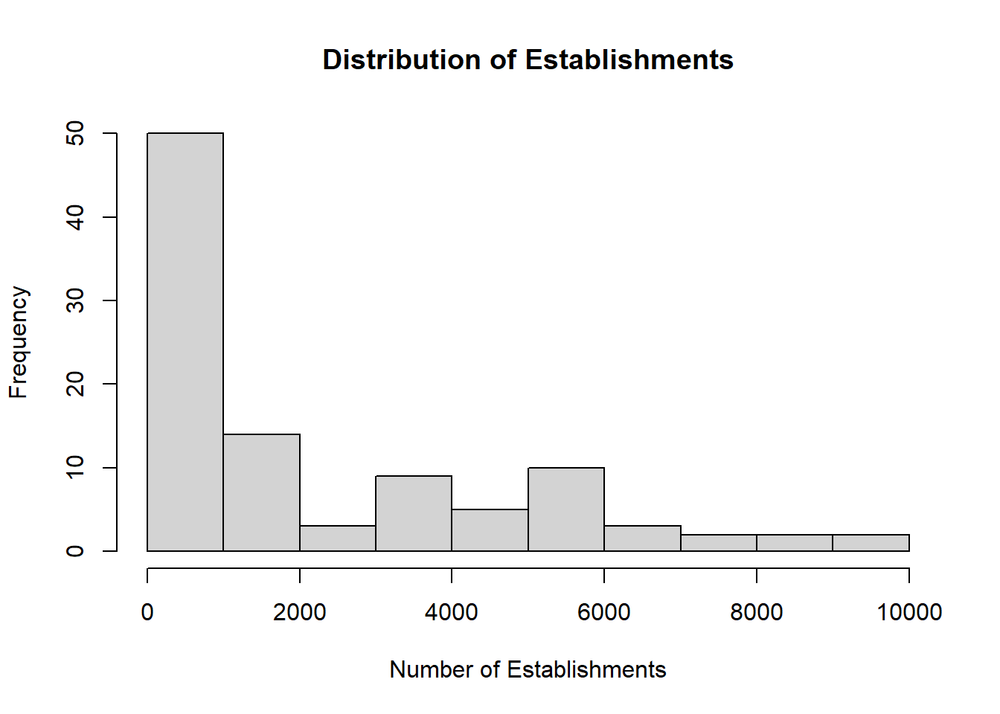
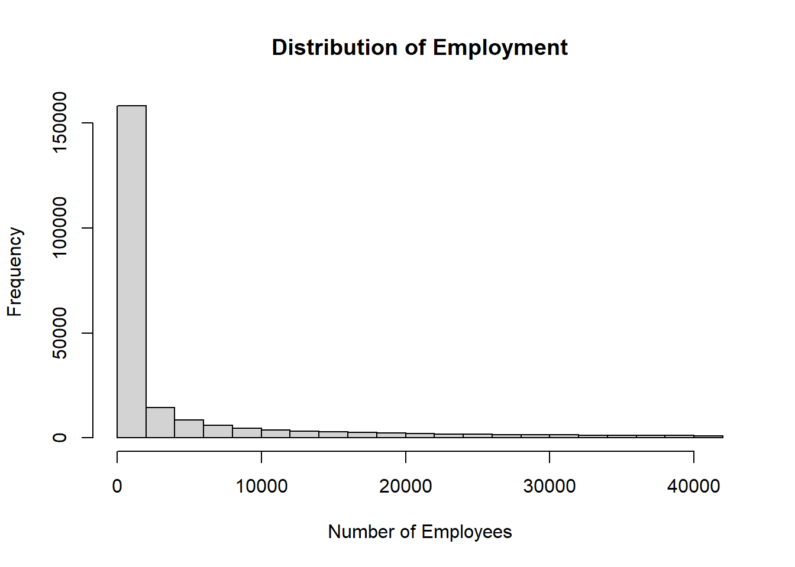

A toy example of generating a somewhat plausible distribution of

- establishments across industries
- employment across establishments

Might still want to add payroll to approxmate the (Syn)LBD.

> A SAS version is available in directory [sas](sas/).


## Basic parameters


::: {.cell}

```{.r .cell-code}
# Number of industries
indcnt <- 100
# Largest number of establishments per industry
maxestabcnt <- 10000
# Smallest industry
minestabcnt <- 100
seed1 <- 123456

# For any establishment, largest size
maxemp <- 42000
# smallest estab size
minemp <- 1
seed2 <- 1234567
```
:::


Draw establishment count distribution across industries
- Use log normal distribution
- Set seeds for reproducibility


::: {.cell}

```{.r .cell-code}
set.seed(seed1)

# 
industries <- data.frame(
  industry = 1:indcnt,
  estabs = exp(runif(indcnt) * (log(maxestabcnt) - log(minestabcnt)) + log(minestabcnt))
)
```
:::


# Summary statistics for estabs


```{.r .cell-code}
summary(industries$estabs) -> estabs_summary 
data.frame(
  Statistic = names(estabs_summary),
  Value = as.numeric(estabs_summary)) |>  kable()
```


|Statistic |     Value|
|:---------|---------:|
|Min.      |  100.6058|
|1st Qu.   |  241.3953|
|Median    |  966.8324|
|Mean      | 2213.3278|
|3rd Qu.   | 3941.5867|
|Max.      | 9720.1530|

::: {.cell}

```{.r .cell-code}
indfig <- hist(industries$estabs, main="Distribution of Establishments", xlab="Number of Establishments")
```

::: {.cell-output-display}
{width=672}
:::
:::


# Employment for each establishment in each industry


::: {.cell}

```{.r .cell-code}
set.seed(seed2)

fakelbd <- do.call(rbind, lapply(1:nrow(industries), function(i) {
  data.frame(
    industry = industries$industry[i],
    emp = exp(runif(industries$estabs[i]) * (log(maxemp) - log(minemp)) + log(minemp))
  )
}))
```
:::


# Summary statistics for Employment (Establishment size)


```{.r .cell-code}
# For the employment summary
emp_summary <- summary(fakelbd$emp)
data.frame(
  Statistic = names(emp_summary),
  Value = as.numeric(emp_summary)
) |> kable(caption = "Summary of Employment")
```


Table: Summary of Employment

|Statistic |        Value|
|:---------|------------:|
|Min.      |     1.000171|
|1st Qu.   |    14.242971|
|Median    |   202.350039|
|Mean      |  3939.293826|
|3rd Qu.   |  2914.761610|
|Max.      | 41998.030050|

::: {.cell}

```{.r .cell-code}
sizefig <- hist(fakelbd$emp, main="Distribution of Employment", xlab="Number of Employees")
```

::: {.cell-output-display}
{width=672}
:::
:::


